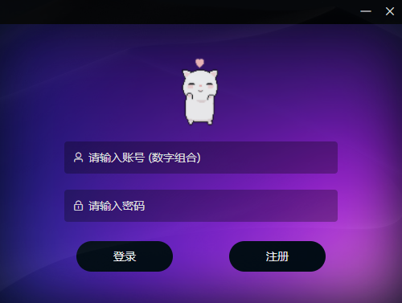
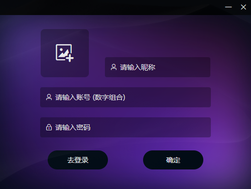
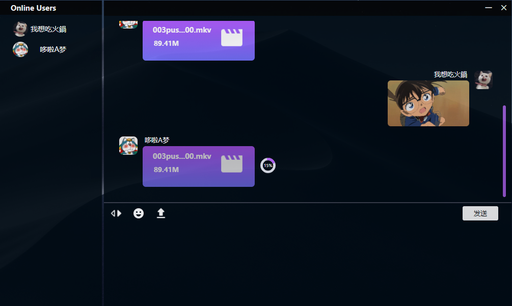

# Chat

## Vue+Electron+Go 实现的多人聊天室桌面应用

Chat是一款集上传下载、多人聊天的一款桌面应用。

## 🛠 使用的技术栈
前端：
- [Electron](https://electronjs.org/)
- [Nodejs](https://nodejs.org/)
- [electron-builder](https://www.electron.build/) 
- [Vue](https://vuejs.org/)
- [Element](https://element.eleme.io)

服务器：
- [Go](https://golang.google.cn/)
- [Redis](https://redis.io/)
- 原生Socket

## ✨ 功能亮点
- 🕹 简洁的聊天界面
- 🕹多人聊天
- 🔔 传输任务完成通知提醒
- ✨ 支持拖拽文件上传
- ✨ 支持图片、音乐及视频下载

## 🖥 应用界面
#### 登录
   
#### 注册
  
#### 主界面
   
  
## ⌨️ 本地开发（可二次开发）

### 克隆代码
```bash
git clone https://github.com/SpiderMan-Park/chat.git
```
项目运行的Node版本是v14.18.0
### 安装依赖
```bash
npm install
```
### 淘宝的npm源
```bash
npm config set registry 'https://registry.npm.taobao.org'
npm config set ELECTRON_MIRROR='https://npm.taobao.org/mirrors/electron/'
```
或者使用[Yarn](https://yarnpkg.com/)安装依赖

### 运行项目
```bash
npm run electron:server
```
### 打包项目
```bash
npm run electron:build
```
项目不包含服务端:smile::smile:
